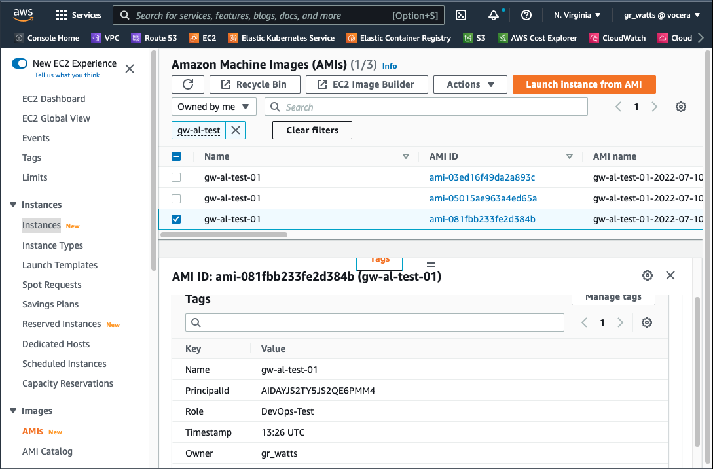

# Create And Tag EC2 AMIs

The script provided with this project creates AMIs from EC2 instances based on parameters provided in the script.

AMI Images can be found in the AWS Console under EC2 --> Images --> AMIs.  Images will be created with the `Name` of the instance, and `AMI Name` of the instance tagged with the date and time the image was taken and with tags applied based on the tags attached to the instance along with the date and time the image was taken.



## Running the script

The script can be run from the command line using the following command:

```bash
./CreateAndTagEC2AMI.py
```

The script takes a number of [parameters](#parameters) that can be provided in the command line and requires a minimum of one `Instance Detail` parameter to be passed for the script to find any instances.

### Connecting to AWS

This script requires the AWS CLI to be [setup and configured](https://vocera.atlassian.net/wiki/spaces/VD/pages/1683521812/AWS+CLI) with a mimimum of the [`default` profile](https://vocera.atlassian.net/wiki/spaces/VD/pages/1683521812/AWS+CLI#Configuring-a-default-profile) configured.  [Named profiles](https://vocera.atlassian.net/wiki/spaces/VD/pages/1683521812/AWS+CLI#More-on-named-profiles) are supported using the `--aws-profile` parameter.

### Parameters

Running the script with `-h` or `--help` will display the following parameters:

```bash
./CreateAndTagEC2AMI.py --help
usage: CreateAndTagEC2AMI.py [-h] [--aws-profile AWS_PROFILE] [--region REGION] [--product PRODUCT] [--environment ENVIRONMENT]
                             [--tenant TENANT] [--role ROLE] [--owner OWNER] [--name NAME] [--extra-tags EXTRA_TAGS]
                             [--instance-ids INSTANCE_IDS] [--add-tags ADD_TAGS] [--log-file LOG_FILE] [--log-level LOG_LEVEL]
                             [--list-only | --wait]

AWS EC2 AMI Creation and Tagging

options:
  -h, --help            show this help message and exit
  --list-only, -lo, --dry-run, --check, -C
                        [Flag] List instances that would be backed up to AMI and exit without creating AMI
  --wait, -w            [Flag] Wait for AMI to be available

AWS Connection Details:
  --aws-profile AWS_PROFILE, -a AWS_PROFILE
                        AWS Profile: default = default (Example: -a vcra-prod)
  --region REGION, -r REGION
                        AWS Region: default = us-east-1 (Example: -r us-east-2)

Instance Details (Tags and/or Instance IDs):
  --product PRODUCT, -p PRODUCT
                        EC2 Instance Product Tag (Example: -p holodeck)
  --environment ENVIRONMENT, -e ENVIRONMENT
                        EC2 Instance Environment Tag (Example: -e sse)
  --tenant TENANT, -t TENANT
                        EC2 Instance Tenant Tag (Example: -t gemini)
  --role ROLE, -rl ROLE
                        EC2 Instance Role Tag (Example: -rl appliance)
  --owner OWNER, -o OWNER
                        EC2 Instance Owner Tag (Example: -o gr_watts)
  --name NAME, -n NAME  EC2 Instance Name Tag (Example: -n gw-al-test-01)
  --extra-tags EXTRA_TAGS, -x EXTRA_TAGS
                        Other tags that can be used to search for AMI images as a comma separated key=value list (Example: -x
                        key1=value1,key2=value2)
  --instance-ids INSTANCE_IDS, -i INSTANCE_IDS
                        Instance IDs to create AMI from as a comma separated list (Example: -i id-123456,id-654321)
  --add-tags ADD_TAGS, -at ADD_TAGS
                        Additional tags to add to AMI as a comma separated key=value list (Example: -at key1=value1,key2=value2)

Log Options:
  --log-file LOG_FILE, -l LOG_FILE
                        Log file location (Example: -l /tmp/createAMI.log)
  --log-level LOG_LEVEL, -ll LOG_LEVEL
                        Log level: default = INFO (Example: -ll DEBUG)
```

All parameters are optional; however the following defaults are used if not provided:

- `--aws-profile`: `default`
- `--region`: `us-east-1`
- `--list-only`: `False`
- `--log-level`: `INFO`
- `--log-file`: None - log only to the console
- `--wait`: `False`

The following limitations or requirements apply to the parameters:

**Note:** wildcards are not supported

- `--aws-profile`: Accepts a single profile name (e.g. `default` or `my-profile`)
- `--region`: Accepts a single region (e.g. `us-east-1` or `us-west-2`)
- `--product`: Accepts a single product tag (e.g. `product-1` or `product-2`)
- `--environment`: Accepts a single environment tag (e.g. `environment-1` or `environment-2`)
- `--tenant`: Accepts a single tenant tag (e.g. `tenant-1` or `tenant-2`)
- `--role`: Accepts a single role tag (e.g. `role-1` or `role-2`)
- `--owner`: Accepts a single owner tag (e.g. `me` or `you`)
- `--name`: Accepts a single name tag (e.g. `my-instance` or `your-instance`)
- `--instance-ids`: Accepts a comma separated list of instance IDs (e.g. `i-123456789,i-987654321`)
- `--extra-tags`: Accepts a comma separated list of key=value pairs (e.g. `custom=test,name=my-instance`)
- `--add-tags`: Accepts a comma separated list of key=value pairs (e.g. `custom=test,name=my-instance`)
- `--log-file`: Requires a single log file path including file name and extension (e.g. `/tmp/log.txt`)
- `--log-level`: Accepts a single log level (e.g. `INFO` or `DEBUG`)
- `--list-only`: Mutually exclusive with `--wait`. Does **not** accept a value, this is a flag.  Including the flag will cause the script to generate a list of the instance IDs that would be backed up to AMI and exit without creating the AMI.  Consider using this option to test the script before running it for real.
- `--wait`: Mutually exclusive with `--list-only`. Does **not** accept a value, this is a flag.  Including the flag will cause the script to wait for the AMI to be available, otherwise it will return immediately after the AMI is created.

**Note:** `--instance-ids` is used to add additional instances to the list of instances to have AMI images created from.  This is useful for adding additional instances over and above any that are found using the supplied tags.
**Note:** `--extra-tags` is used to further filter the search for instances and is added to the filter list alongside `--product`, `--environment`, `--tenant`, `--role`, `--owner`, and `--name`.  This is useful if the tag(s) you require are not covered by this scripts parameters.
**Note:** `--add-tags` is used to add additional tags to the AMI image.  This is useful if you want to add additional tags to the AMI image that are not covered by this scripts parameters.

### Logging

By default logging is set to `INFO` level logging and does not log to a file (log file = `/dev/null`).

The behaviour can be changed with the following parameters:

- `--log-file` or `-l`: The location of the log file.
- `--log-level` or `-ll`: The log level.

### Examples

#### Example with additional instance IDs provided to create AMIs for additional EC2 instances that are not found using the supplied tags:

```bash
┌─(~/Development/Vocera/Bitbucket/DevOps/devops-mngt/scripts/CreateAndTagEC2AMI)──────────────────────────────(grwatts@GRWATTS02-MB:s004)─┐
└─(11:50:44 on master ✹ ✭)──> ./CreateAndTagEC2AMI.py -p operations-tools -e test -i i-036c21c98a1681e68,i-00ecc188f4d9b1d04 -w  -a vcra-nonprod
2022-07-09 16:06:16,675 [INFO] ===================
2022-07-09 16:06:16,676 [INFO] Creating AMI Image(s) from EC2 Instance(s)
2022-07-09 16:06:16,676 [INFO] ===================
2022-07-09 16:06:16,676 [INFO] Supplied arguments
2022-07-09 16:06:16,676 [INFO] ===================
2022-07-09 16:06:16,676 [INFO] Aws_profile : vcra-nonprod
2022-07-09 16:06:16,676 [INFO] Region : us-east-1
2022-07-09 16:06:16,676 [INFO] Product : operations-tools
2022-07-09 16:06:16,676 [INFO] Environment : test
2022-07-09 16:06:16,676 [INFO] Tenant : None
2022-07-09 16:06:16,676 [INFO] Role : None
2022-07-09 16:06:16,676 [INFO] Owner : None
2022-07-09 16:06:16,676 [INFO] Name : None
2022-07-09 16:06:16,676 [INFO] Instance_ids : i-036c21c98a1681e68,i-00ecc188f4d9b1d04
2022-07-09 16:06:16,676 [INFO] Log_file : None
2022-07-09 16:06:16,677 [INFO] Log_level : INFO
2022-07-09 16:06:16,677 [INFO] Wait : True
2022-07-09 16:06:16,677 [INFO] ===================
2022-07-09 16:06:16,677 [INFO] Connecting to AWS
2022-07-09 16:06:16,687 [INFO] Connected to AWS
2022-07-09 16:06:16,687 [INFO] Session Details: Session(region_name='us-east-1')
2022-07-09 16:06:16,687 [INFO] ===================
2022-07-09 16:06:16,687 [INFO] Finding instances based on tags
2022-07-09 16:06:16,716 [INFO] Found credentials in shared credentials file: ~/.aws/credentials
2022-07-09 16:06:16,850 [INFO] Filters: [{'Name': 'tag:Product', 'Values': ['operations-tools']}, {'Name': 'tag:Environment', 'Values': ['test']}]
2022-07-09 16:06:17,636 [INFO] Found instances: ['i-00ecc188f4d9b1d04', 'i-036c21c98a1681e68', 'i-014e493976d07116b']
2022-07-09 16:06:17,636 [INFO] Direct instance IDs provided i-036c21c98a1681e68,i-00ecc188f4d9b1d04
2022-07-09 16:06:17,636 [INFO] Checking if they are not already in the list
2022-07-09 16:06:17,636 [INFO] Instance ID: i-036c21c98a1681e68 already in list
2022-07-09 16:06:17,636 [INFO] Instance ID: i-00ecc188f4d9b1d04 already in list
2022-07-09 16:06:17,636 [INFO] All instances: ['i-00ecc188f4d9b1d04', 'i-036c21c98a1681e68', 'i-014e493976d07116b']
2022-07-09 16:06:17,638 [INFO] ===================
2022-07-09 16:06:17,639 [INFO] Getting tags for instance i-00ecc188f4d9b1d04
2022-07-09 16:06:17,639 [INFO] Getting tags for instance i-036c21c98a1681e68
2022-07-09 16:06:17,639 [INFO] Getting tags for instance i-014e493976d07116b
2022-07-09 16:06:18,274 [INFO] Creating AMI for instance i-014e493976d07116b
2022-07-09 16:06:18,284 [INFO] Creating AMI for instance i-036c21c98a1681e68
2022-07-09 16:06:18,299 [INFO] Creating AMI for instance i-00ecc188f4d9b1d04
2022-07-09 16:06:18,995 [INFO] Image ID: ami-0ace99a5b94e187d6, Image Name: operations-tools-windowsremotedesktop_test-2022-07-09-1606, Image Description: operations-tools-windowsremotedesktop_test-2022-07-09-1606
2022-07-09 16:06:18,997 [INFO] Tagging AMI ami-0ace99a5b94e187d6
2022-07-09 16:06:19,023 [INFO] Image ID: ami-04984605fb4fb20f8, Image Name: operations-tools-nonlegacy_sshserver_test-2022-07-09-1606, Image Description: operations-tools-nonlegacy_sshserver_test-2022-07-09-1606
2022-07-09 16:06:19,026 [INFO] Tagging AMI ami-04984605fb4fb20f8
2022-07-09 16:06:19,117 [INFO] Image ID: ami-000e4eb19368e8a84, Image Name: operations-tools-legacy_sshserver_test-2022-07-09-1606, Image Description: operations-tools-legacy_sshserver_test-2022-07-09-1606
2022-07-09 16:06:19,124 [INFO] Tagging AMI ami-000e4eb19368e8a84
2022-07-09 16:06:19,531 [INFO] Image ami-0ace99a5b94e187d6 tagged
2022-07-09 16:06:19,575 [INFO] Image ami-04984605fb4fb20f8 tagged
2022-07-09 16:06:19,639 [INFO] Image ami-000e4eb19368e8a84 tagged
2022-07-09 16:06:19,642 [INFO] ===================
2022-07-09 16:06:19,642 [INFO] Created AMIs
2022-07-09 16:06:19,642 [INFO] ===================
2022-07-09 16:06:19,642 [INFO] Image Name: operations-tools-windowsremotedesktop_test-2022-07-09-1606 - Image ID: ami-0ace99a5b94e187d6
2022-07-09 16:06:19,642 [INFO] Image Name: operations-tools-nonlegacy_sshserver_test-2022-07-09-1606 - Image ID: ami-04984605fb4fb20f8
2022-07-09 16:06:19,642 [INFO] Image Name: operations-tools-legacy_sshserver_test-2022-07-09-1606 - Image ID: ami-000e4eb19368e8a84
2022-07-09 16:06:19,643 [INFO] ===================
2022-07-09 16:06:19,643 [INFO] Waiting for AMIs to be available
2022-07-09 16:06:19,643 [INFO] ===================
2022-07-09 16:06:19,643 [INFO] Checking AMI states.  Please be patient this may take a few minutes
2022-07-09 16:06:19,643 [INFO] Checking AMI state for ami-0ace99a5b94e187d6 every 30 seconds
2022-07-09 16:06:19,643 [INFO] Checking AMI state for ami-04984605fb4fb20f8 every 30 seconds
2022-07-09 16:06:19,696 [INFO] Checking AMI state for ami-000e4eb19368e8a84 every 30 seconds
2022-07-09 16:06:20,216 [INFO] Image ami-04984605fb4fb20f8 state: pending
2022-07-09 16:06:20,222 [INFO] Image ami-0ace99a5b94e187d6 state: pending
2022-07-09 16:06:20,230 [INFO] Image ami-000e4eb19368e8a84 state: pending
2022-07-09 16:06:50,325 [INFO] Image ami-0ace99a5b94e187d6 state: pending
2022-07-09 16:06:50,346 [INFO] Image ami-000e4eb19368e8a84 state: pending
2022-07-09 16:06:50,450 [INFO] Image ami-04984605fb4fb20f8 state: pending
2022-07-09 16:07:20,490 [INFO] Image ami-0ace99a5b94e187d6 state: pending
2022-07-09 16:07:20,533 [INFO] Image ami-000e4eb19368e8a84 state: pending
2022-07-09 16:07:20,621 [INFO] Image ami-04984605fb4fb20f8 state: pending
2022-07-09 16:07:50,796 [INFO] Image ami-04984605fb4fb20f8 state: available
2022-07-09 16:07:50,798 [INFO] Image ami-000e4eb19368e8a84 state: available
2022-07-09 16:07:51,490 [INFO] Image ami-0ace99a5b94e187d6 state: available
2022-07-09 16:07:51,492 [INFO] ===================
2022-07-09 16:07:51,492 [INFO] Confirming Successful AMI Image IDs
2022-07-09 16:07:51,492 [INFO] ===================
2022-07-09 16:07:52,040 [INFO] Image operations-tools-legacy_sshserver_test-2022-07-09-1606 (ID ami-000e4eb19368e8a84) is available
2022-07-09 16:07:52,045 [INFO] Image operations-tools-windowsremotedesktop_test-2022-07-09-1606 (ID ami-0ace99a5b94e187d6) is available
2022-07-09 16:07:52,329 [INFO] Image operations-tools-nonlegacy_sshserver_test-2022-07-09-1606 (ID ami-04984605fb4fb20f8) is available
2022-07-09 16:07:52,331 [INFO] ===================
2022-07-09 16:07:52,331 [INFO] All done!
```

#### Example of passing additional tags to be added to the create AMIs

```bash
┌─(~/Development/Vocera/Bitbucket/DevOps/devops-mngt/scripts/CreateAndTagEC2AMI)────────────────────────────────────────────────────────────────────────────────────────────────────────────────────────────(grwatts@Graham-T480:s005)─┐
└─(12:05:21 on master ✹ ✭)──> ./CreateAndTagEC2AMI.py  --product operations-tools --environment test --add-tags message1=test,message2=hello --wait                                                                      ──(Wed,Sep07)─┘
2022-09-07 12:06:25,135 [INFO] ===================
2022-09-07 12:06:25,135 [INFO] Creating AMI Image(s) from EC2 Instance(s)
2022-09-07 12:06:25,135 [INFO] ===================
2022-09-07 12:06:25,135 [INFO] Supplied arguments
2022-09-07 12:06:25,135 [INFO] ===================
2022-09-07 12:06:25,135 [INFO] Aws_profile : default
2022-09-07 12:06:25,135 [INFO] Region : us-east-1
2022-09-07 12:06:25,135 [INFO] Product : operations-tools
2022-09-07 12:06:25,135 [INFO] Environment : test
2022-09-07 12:06:25,136 [INFO] Tenant : None
2022-09-07 12:06:25,136 [INFO] Role : None
2022-09-07 12:06:25,136 [INFO] Owner : None
2022-09-07 12:06:25,136 [INFO] Name : None
2022-09-07 12:06:25,136 [INFO] Extra_tags : None
2022-09-07 12:06:25,136 [INFO] Instance_ids : None
2022-09-07 12:06:25,136 [INFO] Add_tags : message1=test,message2=hello
2022-09-07 12:06:25,136 [INFO] Log_file : None
2022-09-07 12:06:25,136 [INFO] Log_level : INFO
2022-09-07 12:06:25,136 [INFO] List_only : False
2022-09-07 12:06:25,136 [INFO] Wait : True
2022-09-07 12:06:25,136 [INFO] ===================
2022-09-07 12:06:25,136 [INFO] Connecting to AWS
2022-09-07 12:06:25,147 [INFO] Connected to AWS
2022-09-07 12:06:25,148 [INFO] Session Details: Session(region_name='us-east-1')
2022-09-07 12:06:25,148 [INFO] ===================
2022-09-07 12:06:25,148 [INFO] Finding instances based on tags
2022-09-07 12:06:25,170 [INFO] Found credentials in shared credentials file: ~/.aws/credentials
2022-09-07 12:06:25,311 [INFO] Filters: [{'Name': 'tag:Product', 'Values': ['operations-tools']}, {'Name': 'tag:Environment', 'Values': ['test']}]
2022-09-07 12:06:26,137 [INFO] Found instances: ['i-00ecc188f4d9b1d04', 'i-036c21c98a1681e68', 'i-014e493976d07116b']
2022-09-07 12:06:26,139 [INFO] ===================
2022-09-07 12:06:26,140 [INFO] Getting tags for instance i-00ecc188f4d9b1d04
2022-09-07 12:06:26,140 [INFO] Getting tags for instance i-036c21c98a1681e68
2022-09-07 12:06:26,141 [INFO] Getting tags for instance i-014e493976d07116b
2022-09-07 12:06:26,808 [INFO] Instance i-014e493976d07116b tags: [{'Key': 'Product', 'Value': 'operations-tools'}, {'Key': 'Environment', 'Value': 'test'}, {'Key': 'Role', 'Value': 'windowsremotedesktop'}, {'Key': 'Name', 'Value': 'operations-tools-windowsremotedesktop_test'}, {'Key': 'Date', 'Value': '2022-09-07'}, {'Key': 'Timestamp', 'Value': '11:06 UTC'}, {'Key': 'Message1', 'Value': 'test'}, {'Key': 'Message2', 'Value': 'hello'}]
2022-09-07 12:06:26,809 [INFO] Creating AMI for instance i-014e493976d07116b
2022-09-07 12:06:26,931 [INFO] Instance i-00ecc188f4d9b1d04 tags: [{'Key': 'Role', 'Value': 'sshlegacy'}, {'Key': 'Product', 'Value': 'operations-tools'}, {'Key': 'Name', 'Value': 'operations-tools-legacy_sshserver_test'}, {'Key': 'Environment', 'Value': 'test'}, {'Key': 'Date', 'Value': '2022-09-07'}, {'Key': 'Timestamp', 'Value': '11:06 UTC'}, {'Key': 'Message1', 'Value': 'test'}, {'Key': 'Message2', 'Value': 'hello'}]
2022-09-07 12:06:26,932 [INFO] Creating AMI for instance i-00ecc188f4d9b1d04
2022-09-07 12:06:27,599 [INFO] Image ID: ami-0acbbefae6a1af108, Image Name: operations-tools-windowsremotedesktop_test-2022-09-07-1106, Image Description: operations-tools-windowsremotedesktop_test-2022-09-07-1106
2022-09-07 12:06:27,602 [INFO] Tagging AMI ami-0acbbefae6a1af108
2022-09-07 12:06:27,650 [INFO] Image ID: ami-0899bbf993d8e2330, Image Name: operations-tools-legacy_sshserver_test-2022-09-07-1106, Image Description: operations-tools-legacy_sshserver_test-2022-09-07-1106
2022-09-07 12:06:27,652 [INFO] Tagging AMI ami-0899bbf993d8e2330
2022-09-07 12:06:27,918 [INFO] Instance i-036c21c98a1681e68 tags: [{'Key': 'Product', 'Value': 'operations-tools'}, {'Key': 'Role', 'Value': 'sshnonlegacy'}, {'Key': 'Environment', 'Value': 'test'}, {'Key': 'Name', 'Value': 'operations-tools-nonlegacy_sshserver_test'}, {'Key': 'Date', 'Value': '2022-09-07'}, {'Key': 'Timestamp', 'Value': '11:06 UTC'}, {'Key': 'Message1', 'Value': 'test'}, {'Key': 'Message2', 'Value': 'hello'}]
2022-09-07 12:06:27,920 [INFO] Creating AMI for instance i-036c21c98a1681e68
2022-09-07 12:06:28,108 [INFO] Image ami-0acbbefae6a1af108 tagged
2022-09-07 12:06:28,197 [INFO] Image ami-0899bbf993d8e2330 tagged
2022-09-07 12:06:28,634 [INFO] Image ID: ami-0993bc78a7dcc6976, Image Name: operations-tools-nonlegacy_sshserver_test-2022-09-07-1106, Image Description: operations-tools-nonlegacy_sshserver_test-2022-09-07-1106
2022-09-07 12:06:28,637 [INFO] Tagging AMI ami-0993bc78a7dcc6976
2022-09-07 12:06:29,147 [INFO] Image ami-0993bc78a7dcc6976 tagged
2022-09-07 12:06:29,149 [INFO] ===================
2022-09-07 12:06:29,150 [INFO] Created AMIs
2022-09-07 12:06:29,150 [INFO] ===================
2022-09-07 12:06:29,150 [INFO] Image Name: operations-tools-windowsremotedesktop_test-2022-09-07-1106 - Image ID: ami-0acbbefae6a1af108
2022-09-07 12:06:29,150 [INFO] Image Name: operations-tools-legacy_sshserver_test-2022-09-07-1106 - Image ID: ami-0899bbf993d8e2330
2022-09-07 12:06:29,150 [INFO] Image Name: operations-tools-nonlegacy_sshserver_test-2022-09-07-1106 - Image ID: ami-0993bc78a7dcc6976
2022-09-07 12:06:29,150 [INFO] ===================
2022-09-07 12:06:29,150 [INFO] Waiting for AMIs to be available
2022-09-07 12:06:29,150 [INFO] ===================
2022-09-07 12:06:29,150 [INFO] Checking AMI states.  Please be patient this may take a few minutes
2022-09-07 12:06:29,151 [INFO] Checking AMI state for ami-0acbbefae6a1af108 every 30 seconds
2022-09-07 12:06:29,151 [INFO] Checking AMI state for ami-0899bbf993d8e2330 every 30 seconds
2022-09-07 12:06:29,186 [INFO] Checking AMI state for ami-0993bc78a7dcc6976 every 30 seconds
2022-09-07 12:06:29,677 [INFO] Image ami-0993bc78a7dcc6976 state: pending
2022-09-07 12:06:29,689 [INFO] Image ami-0899bbf993d8e2330 state: pending
2022-09-07 12:06:29,712 [INFO] Image ami-0acbbefae6a1af108 state: pending
2022-09-07 12:06:59,827 [INFO] Image ami-0993bc78a7dcc6976 state: pending
2022-09-07 12:06:59,847 [INFO] Image ami-0899bbf993d8e2330 state: pending
2022-09-07 12:06:59,976 [INFO] Image ami-0acbbefae6a1af108 state: pending
2022-09-07 12:07:29,976 [INFO] Image ami-0993bc78a7dcc6976 state: pending
2022-09-07 12:07:29,994 [INFO] Image ami-0899bbf993d8e2330 state: pending
2022-09-07 12:07:30,241 [INFO] Image ami-0acbbefae6a1af108 state: pending
2022-09-07 12:08:00,120 [INFO] Image ami-0993bc78a7dcc6976 state: available
2022-09-07 12:08:00,146 [INFO] Image ami-0899bbf993d8e2330 state: available
2022-09-07 12:08:00,496 [INFO] Image ami-0acbbefae6a1af108 state: available
2022-09-07 12:08:00,498 [INFO] ===================
2022-09-07 12:08:00,498 [INFO] Confirming Successful AMI Image IDs
2022-09-07 12:08:00,498 [INFO] ===================
2022-09-07 12:08:01,001 [INFO] Image operations-tools-nonlegacy_sshserver_test-2022-09-07-1106 (ID ami-0993bc78a7dcc6976) is available
2022-09-07 12:08:01,019 [INFO] Image operations-tools-windowsremotedesktop_test-2022-09-07-1106 (ID ami-0acbbefae6a1af108) is available
2022-09-07 12:08:01,025 [INFO] Image operations-tools-legacy_sshserver_test-2022-09-07-1106 (ID ami-0899bbf993d8e2330) is available
2022-09-07 12:08:01,027 [INFO] ===================
2022-09-07 12:08:01,027 [INFO] All done!
```
